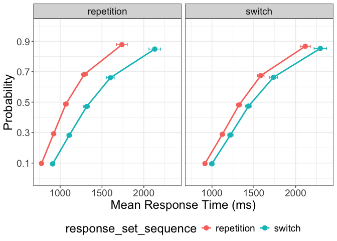

<!-- README.md is generated from README.Rmd. Please edit that file -->

# grangeR

The goal of `grangeR` is to provide—in a single place—several utilility
functions often used in the research of the [Grange
Lab](https://jimgrange.github.io/). These range from general helper
functions to full plotting functions.

## Installation

You can install the development version of `grangeR` from
[GitHub](https://github.com/) with:

``` r
# install.packages("devtools")
devtools::install_github("JimGrange/grangeR")
```

## Implemented Functions

### Plotting

- `get_cdf()`: Produces cumulative density function (CDF) plots for
  response time experimental data. Defective CDFs (i.e., quantiles
  scaled by accuracy) can also be produced.dev
- `get_caf()`: Produces conditional accuracy function (CAF) plots for
  response time and accuracy experimental data.

``` r
# load the package
library(grangeR)

# load the task switching data
data <- grangeR::task_switching

# get a defective CDF plot
cdf_plot <- get_cdf(data = data, 
                    id_var = "id", 
                    conditions = c("response_set_sequence", 
                                   "stimulus_set_sequence"),
                    defective = TRUE)
```


